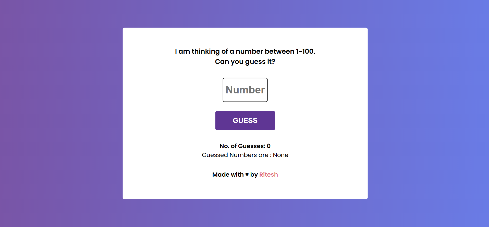

<h1 align="center">🎯 Number Guessing Game</h1>

<p align="center">
A simple and interactive Number Guessing Game built using HTML, CSS, and JavaScript.
</p>

<p align="center">
⭐ If you like this project, don’t forget to give it a star!
</p>

---

## 📖 About the Project

The **Number Guessing Game** is a fun web-based game where the player tries to guess a randomly generated number within a given range.  
The game gives feedback if the guess is **too high** or **too low** until the correct number is found.

---

## 🌐 Live Demo

👉 https://number-guess-play.netlify.app/

---

## 📸 Project Preview



---

## 🚀 Features

- 🎲 Random number generated each game  
- 📢 Feedback (Too High / Too Low)  
- 🔢 Counts number of attempts  
- 🔄 Restart game after winning  
- 🎨 Simple and clean UI  
- 💻 Responsive design  

---

## 🛠️ Tech Stack

- HTML  
- CSS  
- JavaScript  

---

## 🧑‍💻 Getting Started

### 1️⃣ Clone the repository
```bash
git clone https://github.com/Ritesh1coder/Number_Guessing_Game.git

